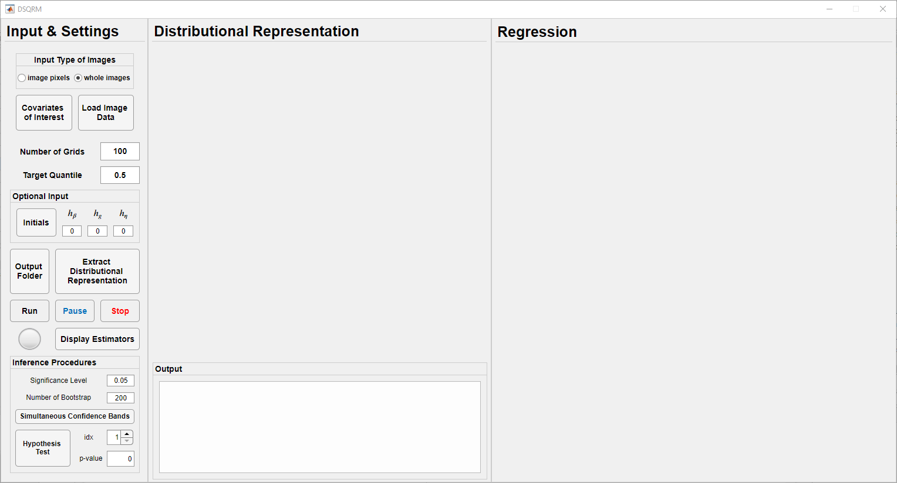
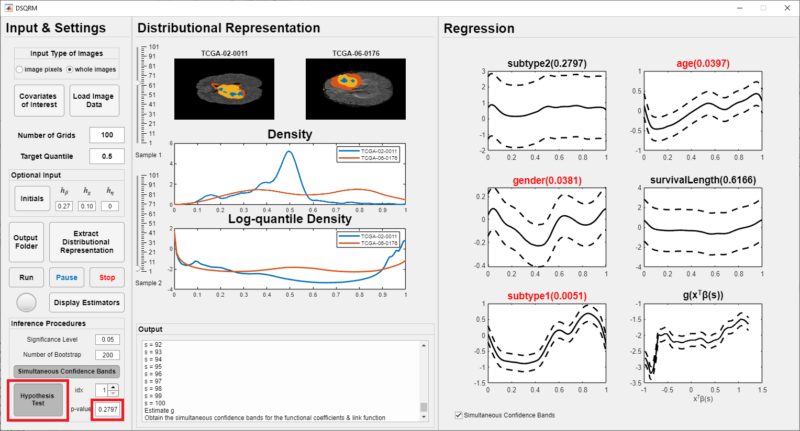

# DSQRM: Distribution-on-scalar Single-index Quantile Regression Model for Handling Tumor Heterogeneity
## Reference
[Zhou, X., Ding, S., Wang, J., Liu, R., Kong, L., & Huang, C. (2024). Distribution-on-scalar Single-index Quantile Regression Model for Handling Tumor Heterogeneity. Technometrics, 1-17.](https://www.tandfonline.com/doi/full/10.1080/00401706.2024.2441686)

# Introduction
## Abstract
**This paper develops a distribution-on-scalar single-index quantile regression modeling framework to investigate the relationship between cancer imaging responses and scalar covariates of interest while tackling tumor heterogeneity. Conventional association analysis methods typically assume that the imaging responses are well-aligned after some preprocessing steps. However, this assumption is often violated in practice due to imaging heterogeneity. Although some distribution-based approaches are developed to deal with this heterogeneity, major challenges have been posted due to the nonlinear subspace formed by the distributional responses, the unknown nonlinear association structure, and the lack of statistical inference. Our method can successfully address all the challenges. We establish both estimation and inference procedures for the unknown functions in our model. The asymptotic properties of both estimation and inference procedures are systematically investigated. The finite-sample performance of our proposed method is assessed by using both Monte Carlo simulations and a real data example on brain cancer images from TCIA-GBM collection.**

## Framework
<details>
  <summary> Workflow </summary>
  
  <figcaption>Fig 1. The workflow of our proposed association analysis framework.</figcaption>
</details>


## Software Interface
\
Fig 2. The interface of the software. 


<br>

# Folder Structure
- **[./utilities/](./utilities/):** 
	contains all the user-defined functions
- **[./simu_results/](./simu_results/):**
	- simu_n%d_N%d_m%d_p%d_nsimu%d.mat: the simulated dataset with density estimators & LQD representations;
	- [simu_estimation_error.csv](simu_results/simu_estimation_error.csv): the mean & std of ISE of estimated functions by our method and the competitors, SIVC (2016) & PWSI
- **[./Software_DSQRM/](./Software_DSQRM/)**
  - **[./DSQRM_Installer_web.exe](./Software_DSQRM/DSQRM_Installer_web.exe)**: the installation file for the software "DSQRM"
    - require MATLAB Runtime, which will automatically download during the installation 
  - **[./DSQRM_V1.mlapp](./Software_DSQRM/DSQRM_V1.mlapp):** the source code for the software.
  - **[./for_redistribution_files_only/](./Software_DSQRM/for_redistribution_files_only/):** contains the executable file on Windows
  - **[./README_DSQRM_software.md](./Software_DSQRM/README_DSQRM_software.md):** the specific usage of the software
  - **[./software_guide.pdf](./Software_DSQRM/software_guide.pdf):** an example of step-by-step usage.
  - **[./examples/](./Software_DSQRM/examples/)**: contains the dataset and results for GBM study

<br>

# Main Results Replication
## [figure3.m](figure3.m): estimators & 95% SCB for a simulated dataset
- **Settings**: n = 200; p = 2; N = 1000; m = 100; $\tau$ = 0.5;
- Expected running time: ~ 30 mins on ``Intel(R) Core(TM) i7-8700 CPU``


## [figure4.m](figure4.m): estimators & 95% SCB for the GBM dataset
- n = 101; p = 5; m = 100; $\tau$ = 0.5 
- Expected running time: ~ 20 mins on ``Intel(R) Core(TM) i7-8700 CPU``


## [table2.m](table2.m): estimation performance from simulated datasets
**Settings**: p = 2; N = 500;  nsimu=200 (# of simulated datasets);
> Given that it's time-consuming to average the estimation performance over 200 simulated datasets, here we separate Table 2 into three parts, corresponding to the three different combinations of sample size n and number of grids m.
> - part 1: n = 100; m = 100;
> - part 2: n = 100; m = 200;
> - part 3: n = 200; m = 100;
> 1. After each part, the procedure will pause and the estimation results will be displayed in the command window, i.e., the MATLAB console; 
> 2. press "Enter" to continue running the following part;  

- **tau_set**: targeted quantile level(s), take values from (0.1, 0.3, 0.5, 0.7, 0.9) - In each part, it's set to run the proposed method with $\tau=0.5$. 
- **Expected running time** with ``tau_set=0.5``: ~ 10 hrs using a parallel pool with 6 workers on ``Intel(R) Core(TM) i7-8700 CPU``
- **Note:** to obtain results for all the quantile levels, i.e., ``tau_set=(0.1, 0.3, 0.5, 0.7, 0.9)``, please uncommment line 13, 24, 35 respectively for each part
- **``SIVC = true``: compare with SIVC (2016) on the generated dataset**
- See the details in [simu_main.m](simu_main.m). 
- **To compare with PWSI:**  run the following command after running "table2.m"
	```r
	# part 1: n=100, p=2, m=100, N=500, nsimu=200
	Rscript simu_PWSI.R 100 2 100 500 200
	# part 2: n=100, p=2, m=200, N=500, nsimu=200
	Rscript simu_PWSI.R 100 2 200 500 200
	# part 3: n=200, p=2, m=100, N=500, nsimu=200
	Rscript simu_PWSI.R 200 2 100 500 200
	```
#### Output: [./simu_results/simu_estimation_error.csv](./simu_results/simu_estimation_error.csv)
> **a table of the following 14 columns:** "n", "N", "ISE_f_mean", "ISE_f_std", "m", "tau", "ISE_beta1_mean", "ISE_beta1_std", "ISE_beta2_mean", "ISE_beta2_std", "ISE_g_mean", "ISE_g_std", "ISE_Psi^{-1}(g)_mean", "ISE_Psi^{-1}(g)_std"


<br>

# Code Description
## [simu_main.m](simu_main.m)
> **the function for calculating the estimation errors from simulated datasets measured by the mean and standard deviation (std) of ISE.**
### (1) Settings
> **For different simulation settings, please modify the corresponding parameters.**
- n: sample size, choose from [100,200]
- p: number of covariates, p = 2
- m: number of grids for lqd functions, choose from [100,200]
- N: number of data points in each sample, choose from [500,1000]
- nsimu: number of simulated datasets, nsimu = 200
- tau_set: targeted quantile levels, (0.1, 0.3, 0.5, 0.7, 0.9)
- SIVC: logical value, true or false, whether to get estimators by SIVC (2016)

### (2) Procedures
#### Step 1. Generate covariates & images given the input of settings;
#### Step 2. Get the estimators by our method, and calculate the mean & std of integrated squared errors (ISE) of the estimators; 
	(i) Extract the density estimators & LQD representations from the generated images;
	(ii) Get the estimators of the functional coefficients & link function 
	given different quantile levels, (0.1, 0.3, 0.5, 0.7, 0.9);
	(iii) Calculate the mean & std of ISE of the estimators and display the errors in a table.
#### Step 3. Get the estimators by SIVC (2016) based on extracted LQD representations, and calculate the mean & std of ISE of the estimators.

### (3) An example 
> **Settings: n=100, p=2, m=100, N=500, nsimu=200, tau_set= (0.1, 0.3, 0.5, 0.7, 0.9).**
#### (i) Our method & SIVC (2016)
**Run the command through MATLAB command prompt**
```matlab
[T_all, all_betaest, all_gest, all_dgest, all_gest_inv, ...
	all_betaest_SIVC, all_gest_SIVC, all_gest_inv_SIVC] = ...
	simu_main(100, 2, 100, 500, 200, 0.1:0.3:0.9, true);
```
#### (ii) Point-wise Single-index (PWSI) method
**Run the R script "simu_PWSI.R" using the command line:**
```r
Rscript simu_PWSI.R 100 2 100 500 200
```


<br>

## [DSQRM.m](DSQRM.m)
> **the main function of the workflow shown in Fig 1.**
### Input:
- x: A set of covariates of interest
- v: Brain tumor images with pixel intensities
- m: The number of grids for the measurement of density estimators extracted from the images
- tau_set: a set of targeted quantile levels
- <mark>For other optional arguments</mark>, see the details in [DSQRM.m](DSQRM.m)
### Output:
- fhat: estimated denstiies, (n, N)
- f_support: support of estimated densities, (n, N)
- hf: bandwidth for density estimators, (1, n)
- ally: LQD representation of fhat, (n, m)
- all_betaest: estimated functional coefficients at targeted quantile levels, (p,m,ntau)
- all_gest: estimated link function at target quantile levels, (n,m,ntau)
- all_dgest: estimated first derivative of the link function at target quantile levels, (n,m,ntau)
- all_gest_inv: the inversed transformation of estimated gest, (n,m,ntau)

- **Optional:**
	- all_Cb_beta: simultaneous confidence bands for estimated coefficients beta_l(s), l=1,...,p; (p,ntau)
	- all_Cr_beta: simultaneous confidence region for estimated coefficient functions beta(s), (1, ntau)
	- all_Cb_g: simultaneous confidence band for estimated link function gest(\cdot), (1, ntau)
	- all_pvals: p-values of the hypothesis testing procedures at the targeted quantile levels, (1, ntau)


<br> 
	
# Software Usage 
## <mark>1. Input </mark>
### Covariates of interest
> choose a file of format .csv or .mat, containing the table of covariates of interest, with corresponding variable names. (not including the intercept)
- **.mat file:** containing a variable named "xdesign", which is a table of size (n, p0), with the first column as the sample name, and the column names as the variable names;
  - **n**: sample size 
  - **p0**: the number of covariates
- **.csv file:** the first column is the sample name, and the rest columns are the variables treated as the covariates of interests.
  > [!NOTE] 
  > the continuous variables need to be normalized before being loaded.


### Images
> Click the button **Load Image Data** to choose the images to be analyzed, and the format of this input depends on the choice <mark>**"Input Type of Images".**

#### Input type of images
- **whole images (default):** 3D or 2D images of whole brain, with the corresponding masks for tumor regions. 
    - a folder containing the images & corresponding tumor masks;
    - name of image file: SampleName + "image" + ".nii" / ".nii.gz" 
    - name of mask file: SampleName + 'mask' + ".nii" / ".nii.gz"
      - **ntype**: the number of tumor subtypes, which is the length of the unique nonzero values in a mask. 
- **image pixels:** extracted pixels of the tumor region for each sample.
  - a matlab data file (.mat) containing the pixels extracted from the tumor region (named "tumor_pixels"), & the ratios of each tumor subtype (named "sub_tumor_ratios");
  - **tumor_pixels:**
    -  a cell array of length n, each cell contains the pixels extracted from the tumor region; 
    -  a matrix of size (n, N), if the number of pixels in the tumor region are the same;
  - **sub_tumor_ratios:** a matrix of size (n, ntypes), where each row should be sum up to 1. 

### Design Matrix
> The final design matrix is a combination of the **covariates of interest** & **the tumor ratios of subtypes**, which is a matrix of size (n, p), where **p = p0 + ntype - 1.**


## 2. Settings
> - **Number of Grids:** m, the number of grids for the measurement of log-quantile density transformation.
> - **Target Quantile:** $\tau$, a scalar within the range of (0,1), denoting the target quantile level of the quantile regression. 

<details> 
<summary> <mark>Optional Input</mark> </summary>

#### Initials
> Click the button **Initials** to choose a matlab data file (.mat) containing the initial values for **the functional coefficients** $\beta(s)$ and **the link function** $g(\cdot)$ and its **first derivative** $\dot{g}(\cdot)$. 

The variable names should be
- **beta0**: a matrix of size (p, m)
- **g0**: a matrix of size (n, m)
- **dg0**: a matrix of size (n, m)

#### Bandwidth
> numerical values within (0,1), controlling the smoothness
- $h_\beta$
- $h_g$
- $h_\eta$
</details>


### Output Folder
> Click the button **Output Folder** to choose a folder where the extracted distributional representations & the results of our model to be saved. \
The results will be saved in this folder by the name **"results.mat"**. 


## <mark> 3. Extract Distributional Representation </mark>
> Click the button **Extract Distributional Representation**, to have a visualization:
> - the whole brain with tumor segmentation, 
> - the extracted density functions, 
> - the log-quantile density functions.
 
**The sliders can be adjusted to visualize the representations of other samples.**


<details> 
<summary> Procedures </summary>

#### Input Type of Images = "whole images"
  - load the image & mask files for each sample;
  - extract the tumor pixels & the ratios of each subtype; 
  - obtain the density & log-quantile density (LQD) according to the extracted pixels;
  - display the original image of whole brain, with the annotation of subtypes of tumors; 
  - display the extracted densities & LQDs. 

#### Input Type of Images = "image pixels"
  - load the tumor pixels & the ratios of each subytpe; 
  - obtain the density & log-quantile density (LQD) according to the extracted pixels;
  - display the extracted densities & LQDs. 

</details>


## <mark> 4. Fit the Model </mark>
### (1) Estimation Procedures
- **Run**: click the button to start the algorithm and find the estimators
  - the indicator light turns :green_circle: while the program is running
- **Pause**: click the button to pause the process, and click again to resume the process
  - the indicator light turns :yellow_circle: while the program is paused
  - note: it takes a while for the program to pause
- **Stop**: click the button to stop the program
  - the indicator light turns :red_circle:

#### Dislay the estimators 
> click the button the display the fitted functional coefficients and the link function. 

### (2) Inference Procedures
#### Settings
- Significance level: default = 0.05
- Number of Bootstrap: default = 200

#### Simultaneous Confidence Bands (SCB)
> Click the button to start the bootstrap procedure for constructing SCB for both functional coefficients and link function

user can choose if to display the SCB together with the estimators by checking the box at the bottom of the right panel 

#### Hypothesis Test
> Click the button to start the hypothesis test procedure for one of the functional coefficients
- idx: denotes to conduct the hypothesis test on which covariate
- p-value: the corresponding p-value after the bootstrap procedures


# An Example of GBM Study
## Folder Structure
> **examples/**: this folder contains both input files and output results of this example. 

### - Input
  1. **images & masks**: ['./examples/TCGA_flair_single_slice'](./Software_DSQRM/examples/TCGA_flair_single_slice/)
  2. **covariates of interest:** ['./examples/TCGA_GBM_covariates.csv'](./Software_DSQRM/examples/TCGA_GBM_covariates.csv)
  3. **initial values** for the functional coefficients & link function: ['./examples/initials.mat'](./Software_DSQRM/examples/initials.mat)'examples/initials.mat'
### - Output
  - saved in the matlab file ["./examples/results.mat"](./Software_DSQRM/examples/results.mat)
   


## Visualization of the Result
\
Fig 3. An example of the analysis on GBM dataset using the software.


