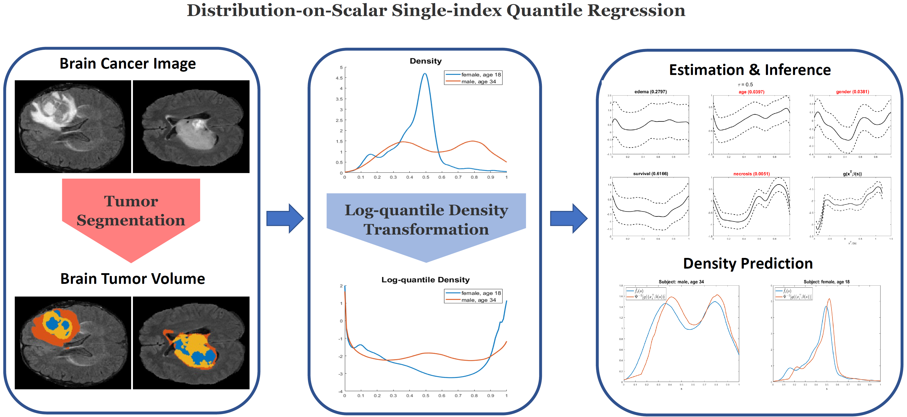

# DSQRM: Distribution-on-scalar Single-index Quantile Regression Model for Handling Tumor Heterogeneity

# Introduction
## Abstract
**This paper develops a distribution-on-scalar single-index quantile regression modeling framework to investigate the relationship between cancer imaging responses and scalar covariates of interest while tackling tumor heterogeneity. Conventional association analysis methods typically assume that the imaging responses are well-aligned after some preprocessing steps. However, this assumption is often violated in practice due to imaging heterogeneity. Although some distribution-based approaches are developed to deal with this heterogeneity, major challenges have been posted due to the nonlinear subspace formed by the distributional responses, the unknown nonlinear association structure, and the lack of statistical inference. Our method can successfully address all the challenges. We establish both estimation and inference procedures for the unknown functions in our model. The asymptotic properties of both estimation and inference procedures are systematically investigated. The finite-sample performance of our proposed method is assessed by using both Monte Carlo simulations and a real data example on brain cancer images from TCIA-GBM collection.**

## Framework
<details>
  <summary> Workflow </summary>
  
  <figcaption>Fig 1. The workflow of our proposed association analysis framework.</figcaption>
</details>

<br>

# Folder Structure
- **[./utilities/](./utilities/):** 
	contains all the user-defined functions
- **[./simu_results/](./simu_results/):**
	- simu_n%d_N%d_m%d_p%d_nsimu%d.mat: the simulated dataset with density estimators & LQD representations;
	- [simu_estimation_error.csv](simu_results/simu_estimation_error.csv): the mean & std of ISE of estimated functions by our method and the competitors, SIVC (2016) & PWSI
- **[./Software_DSQRM/](./Software_DSQRM/)**
  - **[./DSQRM_Installer_web.exe](./Software_DSQRM/DSQRM_Installer_web.exe)**: the installation file for the software "DSQRM"
    - require MATLAB Runtime, which will automatically download during the installation 
  - **[./DSQRM_V1.mlapp](./Software_DSQRM/DSQRM_V1.mlapp):** the source code for the software.
  - **[./for_redistribution_files_only/](./Software_DSQRM/for_redistribution_files_only/):** contains the executable file on Windows
  - **[./README_DSQRM_software.md](./Software_DSQRM/README_DSQRM_software.md):** the specific usage of the software
  - **[./software_guide.pdf](./Software_DSQRM/software_guide.pdf):** an example of step-by-step usage.
  - **[./examples/](./Software_DSQRM/examples/)**: contains the dataset and results for GBM study

<br>

# Main Results Replication
## [figure3.m](figure3.m): estimators & 95% SCB for a simulated dataset
- **Settings**: n = 200; p = 2; N = 1000; m = 100; $\tau$ = 0.5;
- Expected running time: ~ 30 mins on ``Intel(R) Core(TM) i7-8700 CPU``


## [figure4.m](figure4.m): estimators & 95% SCB for the GBM dataset
- n = 101; p = 5; m = 100; $\tau$ = 0.5 
- Expected running time: ~ 20 mins on ``Intel(R) Core(TM) i7-8700 CPU``


## [table2_part1_median.m](table2_part1_median.m): estimation performance from simulated datasets
> Given that it's time-consuming to average the estimation performance over 200 simulated datasets, here we only replicate part of table 2, i.e., the first setting with $\tau=0.5$. 
- **Settings**: n = 100; p = 2; N = 500; m = 100; $\tau=0.5$; nsimu=200 (# of simulated datasets)
- Expected running time: ~ 10 hrs using a parallel pool with 6 workers on ``Intel(R) Core(TM) i7-8700 CPU``

<br>

# Code Description
## [DSQRM.m](DSQRM.m)
> **the main function of the workflow shown in Fig 1.**
### Input:
- x: A set of covariates of interest
- v: Brain tumor images with pixel intensities
- m: The number of grids for the measurement of density estimators extracted from the images
- tau_set: a set of targeted quantile levels
- <mark>For other optional arguments</mark>, see the details in [DSQRM.m](DSQRM.m)
### Output:
- fhat: estimated denstiies, (n, N)
- f_support: support of estimated densities, (n, N)
- hf: bandwidth for density estimators, (1, n)
- ally: LQD representation of fhat, (n, m)
- all_betaest: estimated functional coefficients at targeted quantile levels, (p,m,ntau)
- all_gest: estimated link function at target quantile levels, (n,m,ntau)
- all_dgest: estimated first derivative of the link function at target quantile levels, (n,m,ntau)
- all_gest_inv: the inversed transformation of estimated gest, (n,m,ntau)

- **Optional:**
	- all_Cb_beta: simultaneous confidence bands for estimated coefficients beta_l(s), l=1,...,p; (p,ntau)
	- all_Cr_beta: simultaneous confidence region for estimated coefficient functions beta(s), (1, ntau)
	- all_Cb_g: simultaneous confidence band for estimated link function gest(\cdot), (1, ntau)
	- all_pvals: p-values of the hypothesis testing procedures at the targeted quantile levels, (1, ntau)


## [simu_main.m](simu_main.m)
> **the function for calculating the estimation errors from simulated datasets measured by the mean and standard deviation (std) of ISE.**
### (1) Settings
> **For different simulation settings, please modify the corresponding parameters.**
- n: sample size, choose from [100,200]
- p: number of covariates, p = 2
- m: number of grids for lqd functions, choose from [100,200]
- N: number of data points in each sample, choose from [500,1000]
- nsimu: number of simulated datasets, nsimu = 200
- tau_set: targeted quantile levels, (0.1, 0.3, 0.5, 0.7, 0.9)
- SIVC: logical value, true or false, whether to get estimators by SIVC (2016)

### (2) Procedures
#### Step 1. Generate covariates & images given the input of settings;
#### Step 2. Get the estimators by our method, and calculate the mean & std of integrated squared errors (ISE) of the estimators; 
	(i) Extract the density estimators & LQD representations from the generated images;
	(ii) Get the estimators of the functional coefficients & link function 
	given different quantile levels, (0.1, 0.3, 0.5, 0.7, 0.9);
	(iii) Calculate the mean & std of ISE of the estimators and display the errors in a table.
#### Step 3. Get the estimators by SIVC (2016) based on extracted LQD representations, and calculate the mean & std of ISE of the estimators.

### (3) An example 
> **Settings: n=100, p=2, m=100, N=500, nsimu=200, tau_set= (0.1, 0.3, 0.5, 0.7, 0.9).**
#### (i) Our method & SIVC (2016)
**Run the command through MATLAB command prompt**
```ruby
[T_all, all_betaest, all_gest, all_dgest, all_gest_inv, ...
	all_betaest_SIVC, all_gest_SIVC, all_gest_inv_SIVC] = ...
	simu_main(100, 2, 100, 500, 200, 0.1:0.3:0.9, true);
```
#### (ii) Point-wise Single-index (PWSI) method
**Run the R script "simu_PWSI.R" using the command line:**
```
Rscript simu_PWSI.R 100 2 100 500 200
```


